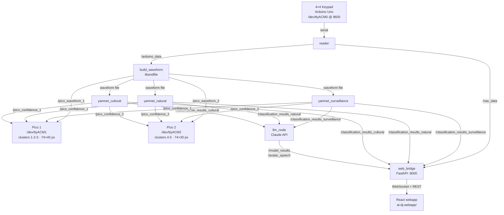

# AI DJ — Audio Bias Pavilion

Interactive kiosk that lets visitors compose a 30-second audio mix using a 4×4 keypad, then classifies it live with three parallel YAMNet models (surveillance / natural / cultural) and displays results on a React webapp and a 74×75 RGB LED matrix.

---

## Architecture



---

## Hardware

| Board | Port | Baud | Role |
|-------|------|------|------|
| Arduino Uno R3 | `/dev/ttyACM0` | 9600 | 4×4 keypad reader |
| RPi Pico 1 | `/dev/ttyACM1` | 115200 | LED clusters 1-3 (GP9, GP11, GP12) |
| RPi Pico 2 | `/dev/ttyACM2` | 115200 | LED clusters 4-5 (GP11, GP12) |

**Keypad layout**

| Key | Serial token | Function |
|-----|-------------|---------|
| 1–9 | `PRESS_1`…`PRESS_9` / `RELEASE_n` | Hold-to-play sound buttons |
| 0 | `PRESS_10` / `RELEASE_10` | Sound button 10 |
| A | `NAV_A` | Navigate up |
| B | `NAV_B` | Navigate left |
| C | `NAV_C` | Navigate right |
| D | `NAV_D` | Navigate down |
| `*` | `SELECT` | Confirm / start |
| `#` | `BACK` | Back / redo |

**LED matrix**: 74 px tall × 75 px wide, arranged in 5 clusters of 74×15. Two RPi Pico microcontrollers drive it:

- **Pico 1** — clusters 1, 2, 3 → columns 0–44 (74×45 px, ~18 s of audio)
- **Pico 2** — clusters 4, 5 → columns 45–74 (74×30 px, ~12 s of audio)

The waveform spans all clusters; classification confidence is colour-coded across both Picos (surveillance = red, natural = green, cultural = blue).

---

## ROS2 Topics

| Topic | Type | Publisher | Description |
|-------|------|-----------|-------------|
| `/arduino_data` | String | reader | `PRESS_n` / `RELEASE_n` events |
| `/nav_data` | String | reader | `NAV_*`, `SELECT`, `BACK` events |
| `/state_control` | String | reader | mirrors SELECT for state machine |
| `/led_matrix` | UInt8MultiArray | build_waveform | 74×75 grayscale waveform (10 Hz) |
| `/pico_waveform_1` | Float32MultiArray | build_waveform | normalised waveform — Pico 1 (74×45, clusters 1-3) |
| `/pico_waveform_2` | Float32MultiArray | build_waveform | normalised waveform — Pico 2 (74×30, clusters 4-5) |
| `/pico_confidence_1` | String | yamnet_classification | per-second confidence JSON — Pico 1 (~18 s) |
| `/pico_confidence_2` | String | yamnet_classification | per-second confidence JSON — Pico 2 (~12 s) |
| `/classification_results_{surveillance,natural,cultural}` | String | yamnet_classification | top-5 results per model |
| `/model_results` | String | llm_node | JSON: model + top3 + Claude sentence |
| `/avatar_speech` | String | llm_node | plain English sentence |
| `/led_paint_commands` | String | yamnet_classification | colour overlay commands |

---

## State Machine

```
welcome → [SELECT] → countdown (3s) → recording (30s) → recording_complete
recording_complete → [POST /api/classify] → analyzing → [3 models done] → results
recording_complete → [POST /api/redo]    → countdown  (new round)
```

---

## Quick Start

### Option A — Docker (Raspberry Pi 5, recommended)

```bash
# 1. Clone repo and enter directory
git clone <repo-url> ~/rosnetwork && cd ~/rosnetwork

# 2. Place binary assets (not tracked in git)
#    models/  ← YAMNet.onnx + surveillance/natural/cultural _head.onnx + *_classes.txt
#    sounds/  ← 10 folders (one per button) each with WAV files

# 3. Configure secrets
cp .env.example .env
nano .env           # set ANTHROPIC_API_KEY

# 4. Build image (~15 min first time on RPi5)
docker compose build

# 5. Plug in Arduino + both Picos, then start
docker compose up
```

Open `http://<rpi5-ip>:8000` in a browser.

Skip the LED matrix writer during testing:
```bash
docker compose run --rm ai-dj bash -c \
  "source /opt/ros/kilted/setup.bash && source install/setup.bash && \
   ros2 launch cpp_pkg bringup.launch.py with_writer:=false"
```

---

### Option B — Native dev (desktop / x86)

**Prerequisites**: ROS2 Kilted, ONNX Runtime, Node.js 20, `anthropic` Python package.

```bash
# Install Python deps
pip3 install -r requirements.txt --break-system-packages

# Build ROS2 workspace
source /opt/ros/kilted/setup.bash
colcon build
source install/setup.bash

# Build React webapp (first time only)
cd ai-dj-webapp && npm ci && npm run build && cd ..

# Set API key
export ANTHROPIC_API_KEY=sk-ant-...

# Terminal 1 — ROS network (no hardware connected on desktop)
ros2 launch cpp_pkg bringup.launch.py with_writer:=false

# Terminal 2 — Webapp dev server (hot reload, proxies to :8000)
cd ai-dj-webapp && npm run dev
```

Open `http://localhost:5173`.

---

## Environment Variables

| Variable | Required | Default | Description |
|----------|----------|---------|-------------|
| `ANTHROPIC_API_KEY` | Yes | — | Anthropic API key |
| `CLAUDE_MODEL` | No | `claude-haiku-4-5-20251001` | Model for llm_node |
| `AI_DJ_WORKSPACE` | No | `~/iaac/ai4all/rosnetwork` | Root path (Docker sets `/ros2_ws`) |
| `ROS_DOMAIN_ID` | No | `0` | ROS2 domain |

Copy `.env.example` → `.env` and fill in values. `.env` is git-ignored.

---

## Launch Arguments

```bash
ros2 launch cpp_pkg bringup.launch.py \
  with_llm:=true       \  # set false to skip Claude node
  with_writer:=false   \  # enable when Pico serial writers are implemented
  ws_delay:=8.0        \  # seconds before web_bridge starts
  llm_delay:=12.0         # seconds before llm_node starts
```

---

## Node Summary

| Node | Lang | Package | Key deps |
|------|------|---------|----------|
| `reader` | C++ | cpp_pkg | Serial `/dev/ttyACM0` |
| `build_waveform` | C++ | cpp_pkg | libsndfile |
| `yamnet_classification` ×3 | C++ | cpp_pkg | ONNX Runtime |
| `writer` | C++ | cpp_pkg | Serial — placeholder for future Pico writers |
| `web_bridge` | Python | py_pkg | FastAPI, uvicorn, websockets |
| `llm_node` | Python | py_pkg | anthropic SDK |

---

## Project Structure

```
rosnetwork/
├── src/
│   ├── cpp_pkg/
│   │   ├── src/
│   │   │   ├── reader.cpp
│   │   │   ├── build_waveform.cpp
│   │   │   ├── yamnet_classification.cpp
│   │   │   ├── writer.cpp
│   │   │   └── serial_port.cpp
│   │   └── launch/
│   │       └── bringup.launch.py     ← full system launch
│   └── py_pkg/
│       └── py_pkg/
│           ├── web_bridge.py
│           └── llm_node.py
├── ai-dj-webapp/                     ← React 19 + Vite kiosk UI
├── sketches/
│   ├── button_reader/                ← Arduino Uno firmware (4×4 keypad)
│   └── matrix_display/
│       ├── pico1_matrix.ino          ← Pico 1 firmware (clusters 1-3, cols 0-44)
│       ├── pico2_matrix.ino          ← Pico 2 firmware (clusters 4-5, cols 45-74)
│       └── zone1_02.ino              ← Hardware test sketch (standalone)
├── models/                           ← ONNX files (git-ignored)
├── sounds/                           ← WAV files (git-ignored)
├── Dockerfile
├── docker-compose.yml
├── .env.example
└── requirements.txt
```

---

## Arduino Firmware

Upload `sketches/button_reader/button_reader.ino` via Arduino IDE or:

```bash
arduino-cli lib install Keypad
arduino-cli compile --fqbn arduino:avr:uno sketches/button_reader
arduino-cli upload -p /dev/ttyACM0 --fqbn arduino:avr:uno sketches/button_reader
```

---

## Troubleshooting

**Serial permission denied**
```bash
sudo usermod -aG dialout $USER   # log out and back in
```

**`anthropic` not found in llm_node**
```bash
pip3 install anthropic --break-system-packages
```

**ONNX Runtime not found at build time**
```bash
# Install to /opt/onnxruntime/ then:
export CMAKE_PREFIX_PATH=/opt/onnxruntime:$CMAKE_PREFIX_PATH
colcon build --packages-select cpp_pkg
```

**Simulate button presses without hardware**
```bash
ros2 topic pub /arduino_data std_msgs/String "data: 'PRESS_3'" --once
ros2 topic pub /nav_data std_msgs/String "data: 'SELECT'" --once
```

---

## Acknowledgements

YAMNet — Google Research / AudioSet · ONNX Runtime — Microsoft · ROS2 — Open Robotics
